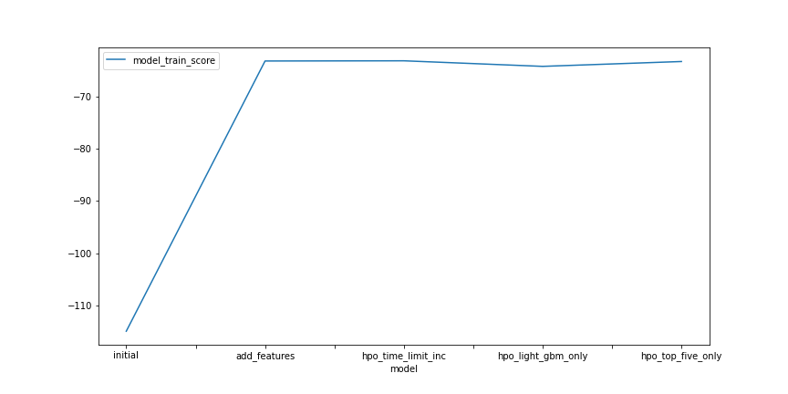
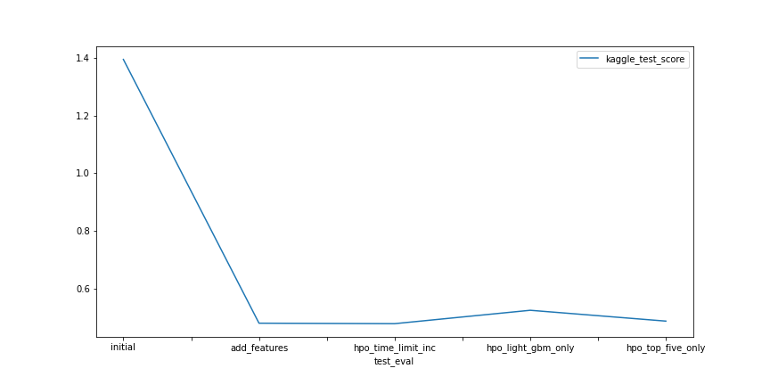

# Report: Predict Bike Sharing Demand with AutoGluon Solution
#### Name: Dan Truong

## Initial Training
### What did you realize when you tried to submit your predictions? What changes were needed to the output of the predictor to submit your results?
First of all, Kaggle did not allow submissions with negative values (this makes sense as demand cannot take on a value less than 0), so we had to modify any negative values to just 0. Additionally, we had to submit our predictor's output with the proper submission format. This means having a CSV file with an exact column with the `datetime`'s, so we had to append the predictions to our `submission.csv` file.

### What was the top ranked model that performed?
The top ranked model that performed was the one with the AutoGluon higher level parameter of `time_limit` set to `1200`, with a Kaggle test score of `0.47933`.
The scores were calculated by determining the Root Mean Squared Logarithmic Error, which means that a score closer to 0 is better.

## Exploratory data analysis and feature creation
### What did the exploratory analysis find and how did you add additional features?
One new feature I added was isolating the `hour` values from `datetime` column. The issue with the `datetime` column is that original data sets contained different values for each row--by parsing the `hour` out, we were able to create a new column where the data was bucketed evenly across different values (hours of the day in the case). This makes the `hour` a potential value that could show trends with bike demand within the day.

### How much better did your model perform after adding additional features and why do you think that is?
After the adding just the `hour` feature, the model went from a Kaggle score of `1.39432` to `0.48096`, a difference of 0.91336! As mentioned in the previous answer, the original `datetime` column consisted of mostly different values, which made it hard to incorporate time into the predictor. In this case, the `datetime` values resembled more of a continuum of values. With the `hour` extracted as a column, the data points can now also be categorized into discrete hours. Intuitively, it would make sense to consider the hour of the day when predicting bike demands; it is likely that one would not be out biking in the middle of the night, so demand would be lower during hour after-midnight hours. It is important to note that not all new features can provide this type of improvement--with EDA and looking at the features, we can see where potential features can be extracted to optimize our models.

## Hyper parameter tuning
### How much better did your model perform after trying different hyper parameters?
After trying out various hyperparameter settings, my best model (HPO \#1)was able to achieve a score of `0.47933`, an improvement of 0.00163 from the new features model that used the original settings.

I believe that HPO \#1 scored the best because of how much time AutoGluon had to train the model with the data. This allowed the training process to run on more stack levels of more models. Going through some documentation by Cornell about [Ensembled Selection](https://www.cs.cornell.edu/~alexn/papers/shotgun.icml04.revised.rev2.pdf), it appears that such models are constructed from running all other models on the feature values, choosing the highest performing model, and then repeating the steps. With each round (stack level), the winning result is averaged into the results of the previous winners.

However, we also had some hyperparameters settings that did not predict as well.

For instance, the second hyperparameter optimization attempt was to restrict the models to just the LightGBM models and select the one LGBM model whose individual hyperparameters yielded the best training score. Even when the best model turned out to be a WeightedEnsemble of LightGBM models (of different `max_levels` and `extra_trees` values), this one actually performed worse than the model with HPO\#1, and led me to believe that solely relying on LightGBM was not the ideal option.

Our other hyperparameter setting was to use the top five models (excluding the `WeightedEnsemble`'s) that yielded the highest training score with HPO \#1 settings (`time_limit = 1200`). In this case, we trained the following models:
* FastAI Neural Network
* CatBoost
* Light GBM with Extra Trees
* Extra Trees
* Light GBM
The winning model ended up being a `WeightedEnsemble` with a stack level of 3, but even then, it wasn't as accurate as the model with HPO\#1. This further evidenced the fact when tuning hyperparameters, having more time to test and validate more model options can yield better results.

The largest downside of HPO\#1, however, was the fact that it two double the amount of time for the training to complete. This is definitely something that I will have to weigh as I continue to train other models in future projects, especially when I use services on AWS that charge on an hourly basis.

### If you were given more time with this dataset, where do you think you would spend more time?
I would also consider the day of the week. It would be interesting to see how bike demand on a Tuesday compares to a weekend date like Saturday--there might be some additional trends that can help us train our model that predicts better with data on the day of the week. I would have to spend more time looking into any functions that can convert the date to such categorical days. This would be a much granular feature than just relying on the `workingday` column, which only indicates `true` or `false`.

I would also train the models using more stack folds on each models, which involves running multiple attempts on each model with a different subset of data for training and validation. This is very time consuming, but it would hopefully prevent less bias and overfitting in my training/validation data.

### Create a table with the models you ran, the hyperparameters modified, and the kaggle score.
|Model|Change 1|Change 2|Change 3|Score|
|--|--|--|--|--|
|initial|N/A|N/A|N/A|1.39432|
|add_features|Added `hour` column (not a hyperparameter).|N/A|N/A|0.48096|
|hpo1_time_limit_inc|Default model options|Default hyperparameters for default models|Increased `time_limit` to 1200|0.47933|
|hpo2_light_gbm_only|Included `GBM` models only|Multiple GBM `max_depth` options|Default `time_limit` of 600|0.52567|
|hpo3_top_five_only|Included `FASTAI`, `CAT`, `XT`, `GBM` models only|Default hyperparameters for listed models|Removed `time_limit` to allow full completion|0.48817|

### Create a line plot showing the top model score for the three (or more) training runs during the project.

### Create a line plot showing the top kaggle score for the three (or more) prediction submissions during the project.

## Summary
In all attempts, I noticed that the winning trained models were `WeightedEnsemble` models. Their most accurate prediction performance might be explained by the fact that unlike the others, no one model dominates the prediction algorithm, which means it is less prone to overfitting. However, as evidenced by HPO\#2, the weighted ensemble is only as good as its constituents--without a diverse selection of models, even the weighted average predictions can be less accurate. Seeing the results of HPO\#3 affirms that it can better to have more model options to choose a winner from in each stack level (albeit at the expense of speed). This seems to be a general trend I saw, especially when trying out different hyperparameters. That said, we had `presets` set to `best_quality`, which means most of the hyperparameters were already going to be tuned as much as they could.

That said, the most drastic changes came from adding another feature column to train our model. This is analagous to giving our model some brand new information that it can use to base its prediction on. With that said, it would be interesting to see us parse out different aspects of the data to creature new feature columns. With the ease and automatic nature of AutoGluon, training and testing many models in a reasonable amount of time is very much possible!
